# Bản đồ kiến trúc HIS (codebase map)

> Sơ đồ **trực quan** cho người đọc (bổ sung cho index `tags` dành cho AI agent — xem skill `core-codebase-map-tooling`).
> Sơ đồ nhúng dạng **ảnh SVG** → hiển thị **native trong VS Code Preview (Ctrl+Shift+V) và GitHub — KHÔNG cần extension**, **sống sót qua reload** (khác khối ```mermaid``` cần extension + hay trống sau reload).
> Nguồn Mermaid ở [`diagrams/*.mmd`](./diagrams/). Sửa xong → vẽ lại theo **mục 5**.

---

## 1. Tổng quan hệ thống (runtime / deployment)



## 2. Backend — Clean Architecture (hướng phụ thuộc)



> Quy tắc: phụ thuộc luôn hướng **vào trong** (API → Application → Core; Infrastructure → Application/Core).
> `HIS.API` chỉ wire `HIS.Infrastructure` qua DI — **quên đăng ký DI = lỗi 500** (skill `his-be-module-scaffold`).

## 3. Frontend — 2 lớp (v1 / v2)



**Sơ đồ phụ thuộc module FE (tự sinh bằng dependency-cruiser):**



> Đọc: `M`=pages-v2 · `O`=pages · `4`=api · `H`=layouts · `E`=hooks · `C`=contexts · `6`=components · `U`=utils · `A`=constants · `S`=styles. Mũi tên = "import".
> Quan sát: cả **pages-v2** (M) lẫn **pages** (O) đều phụ thuộc **api** (4) — đúng kiến trúc tách lớp UI ↔ service.

---

## 4. Tra cứu nhanh (cho người + AI)
- **Người:** VS Code — `F12` (định nghĩa) · `Shift+F12` (nơi gọi) · `Ctrl+T` (tìm symbol) · chuột phải → **Show Call Hierarchy** (cây gọi). C# cần extension **C# Dev Kit**.
- **AI agent:** grep index `tags` (`Select-String -Path tags -Pattern '^Tên'`) — xem `core-codebase-map-tooling`.
- **Kiểm tra import vòng (FE):** `cd frontend && npm run dep:check`.

## 5. Cập nhật sơ đồ (regen)
Nguồn Mermaid: `docs/architecture/diagrams/*.mmd`. Sau khi sửa cấu trúc/nội dung:
```powershell
# (a) chỉ sơ đồ phụ thuộc FE — regen từ dependency-cruiser:
cd frontend; npm run dep:mermaid --silent > ../docs/architecture/diagrams/fe-module-deps.mmd; cd ..
# (b) render tất cả .mmd -> .svg (lần đầu tải Chromium qua npx):
pwsh -File scripts/gen-diagrams.ps1
```
> Sửa sơ đồ thủ công (1/2/3): edit file `.mmd` tương ứng rồi chạy (b). Xem khối Mermaid sống (tuỳ chọn) cần extension *Markdown Preview Mermaid Support* — nhưng SVG ở trên đã đủ + ổn định hơn.
