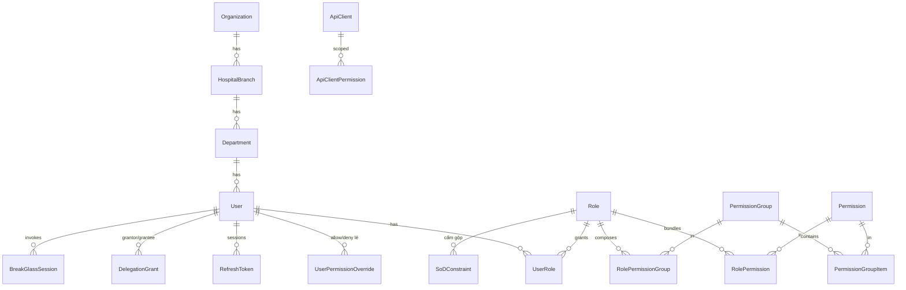

# Đánh giá & Thiết kế lại hệ thống Phân quyền (Authorization) — HIS

> **Ngày:** 2026-07-05 · **Loại:** DESIGN/RESEARCH — chưa code, đã tách GitHub Issues cho các phiên sau
> **Phạm vi:** toàn bộ AuthN/AuthZ backend + frontend + DB + audit + vận hành (500–5.000 user đồng thời, đa cơ sở)
> **Cross-ref:** test ma trận phân quyền #344/#216 (làm CUỐI theo rule fix-first) · lịch sử: #49 (rà secret/RBAC, closed) · #183 (role taxonomy, closed) · #293 (siết gate 8 controller, closed)

---

## 0. Tóm tắt điều hành

**Hiện trạng:** hệ thống có đủ *bàn cờ* RBAC (bảng `Permissions`/`RolePermissions` tồn tại, JWT phát claim `permission`) nhưng **không ai đi cờ** — 100% enforcement chạy bằng `[Authorize(Roles="…")]` role-string; permission bị bỏ không; FE không gate menu/nút; không refresh-token/thu hồi phiên; đa cơ sở (BranchId) không được cô lập ở DbContext; `FrontendCompatController` mở `[AllowAnonymous]` lộ dữ liệu nghiệp vụ.

**Đề xuất (kết luận Bước 11):** kiến trúc **lai 4 lớp, thuần ASP.NET Core (policy-based), KHÔNG cần OPA/Casbin ở quy mô này**:

| Lớp | Trả lời câu hỏi | Cơ chế |
|---|---|---|
| L1 — RBAC lõi | *User có quyền `Prescription.Approve` không?* | Permission granular `Resource.Action` + Role = tập permission; `[RequirePermission]` + dynamic policy provider + cache Redis |
| L2 — Scope | *Trên phạm vi nào?* (bản thân/khoa/cơ sở/toàn hệ thống) | Chiều `ScopeType` gắn vào **lượt gán role** (không nhét vào mã permission); global query filter BranchId |
| L3 — ABAC policy | *Trong ngữ cảnh này có được không?* (quan hệ điều trị, break-glass, SoD, thời hạn) | Policy-as-code: các `IAuthorizationHandler` đặt tên, tham số hóa bằng bảng cấu hình |
| L4 — Field-level | *Được thấy trường nào?* (thu ngân không thấy chẩn đoán tự do) | DTO projection profile theo permission |

**Roadmap 6 phase** đã tách issue (xem §15). Phase 0 là vá lỗ hổng đang hở — làm trước tất cả.

---

## 1. Hiện trạng đã verify trong code (2026-07-05)

| # | Sự thật (bằng chứng) | Đánh giá |
|---|---|---|
| 1 | JWT cấu hình ở `HIS.API/Program.cs:85-129`, fallback policy `RequireAuthenticatedUser()` (`:131-140`) | ✅ Nền tốt: quên `[Authorize]` vẫn bắt đăng nhập |
| 2 | `AuthService.cs` login BCrypt, 2FA OTP email, WebAuthn; token 60' | ✅ AuthN cơ bản ổn |
| 3 | `RefreshToken` = `Guid.NewGuid()` vứt đi, **không có endpoint refresh, không revoke** | 🔴 Không thu hồi được phiên; khóa user/đổi quyền chỉ hiệu lực khi token hết hạn |
| 4 | Claim `permission` được phát (`AuthService.cs:283-286`) nhưng **0 endpoint enforce theo permission**; không `AddPolicy`/`IAuthorizationHandler` nào | 🔴 RBAC nửa vời — toàn bộ gate là role-string |
| 5 | `RoleNames.cs`: ~8 RoleCode LIVE, **~26 role ORPHAN** không bao giờ được emit; map cứng `RoleCodeToEnglishRoles` trong `AuthService.cs:236-246` | 🔴 Taxonomy role hỗn loạn, quyền phụ thuộc dictionary hard-code |
| 6 | FE: `ProtectedRoute` chỉ check đăng nhập (`App.tsx:321-333`); `hasRole/hasPermission` **0 lần dùng ngoài `AuthContext`**; TerminalLayout không lọc menu | 🔴 Mọi user thấy toàn bộ menu; an toàn phụ thuộc 100% BE |
| 7 | `User.BranchId`/`Department.BranchId`/`HospitalBranch` (cây 3 cấp NangCap21) + claim `branchId`, nhưng **global query filter duy nhất là soft-delete** (`HISDbContext.cs:1232`) | 🟠 Đa cơ sở chưa cô lập dữ liệu |
| 8 | `FrontendCompatController` `[AllowAnonymous]` cấp class — GET tồn kho dược, claim BHXH, dịch tễ **không cần đăng nhập** | 🔴 Rò rỉ dữ liệu đang hở |
| 9 | `AuditLogMiddleware` ghi fire-and-forget POST/PUT/DELETE + GET nhạy cảm; **không đếm failed-login, không lockout** | 🟠 Audit có nền nhưng chưa đạt compliance; brute-force được |
| 10 | Bảng `Users/Roles/Permissions/UserRoles/RolePermissions/AuditLogs/UserSessions` đã tồn tại (EF EnsureCreated + seed 7 role, ADMIN full-permission) | ✅ Tái sử dụng được — thiết kế mới là **mở rộng**, không đập đi |
| 11 | Hệ auth song song: `PortalAccounts` (BN), `BhxhInspectorAccounts` (thanh tra) — trust boundary riêng | ✅ Đúng hướng, giữ tách |
| 12 | JWT lưu `localStorage` (`token`, `user`) | 🟠 XSS lấy được token; cần chiến lược refresh-cookie về sau |

---

## 2. Phản biện đề bài (sparring — đọc trước khi dùng phần thiết kế)

1. **"Ma trận permission đầy đủ toàn hệ thống, không bỏ sót" = anti-pattern nếu hiểu là tài liệu tay.** 38 phân hệ × ~10 action × ~30 role ≈ **hơn 10.000 ô** — không con người nào review nổi, và tài liệu sẽ lệch code sau 1 tháng. → Ma trận phải là **DATA** (seed file, có version, có diff khi review), tài liệu chỉ giữ ma trận đại diện + **quy tắc sinh** (§9). Đây là điểm tôi chủ động làm khác đề bài.
2. **"Role chỉ là tập Permission" đúng nhưng KHÔNG ĐỦ cho HIS.** RBAC thuần không diễn đạt được "bác sĩ chỉ xem bệnh nhân *của mình*" — đó là thuộc tính của **lượt gán** (scope) và **ngữ cảnh** (quan hệ điều trị), không phải của permission. Nếu cố nhét vào permission (`Patient.ReadOwn`, `Patient.ReadDept`, `Patient.ReadAll`) sẽ nổ tổ hợp mã. → tách 2 chiều: permission (làm gì) ⊥ scope (trên phạm vi nào).
3. **"DBA không được xem dữ liệu bệnh nhân" — RBAC tầng ứng dụng KHÔNG thể enforce.** DBA đứng dưới ứng dụng. Chỉ giải được bằng hạ tầng: TDE, tách quyền production-access, phiên bastion có ghi hình, masking ở môi trường non-prod. Ghi rõ để không ai ảo tưởng "đã có RBAC là DBA bị chặn" (§10 rule 7).
4. **Time-based permission cho lâm sàng là con dao hai lưỡi.** Chặn quyền bác sĩ ngoài giờ trực nghe "chuẩn ISO" nhưng bệnh nhân trở nặng lúc 2h sáng thì hệ thống chặn nhầm người cứu mình. → time-bound chỉ áp cho **quyền quản trị/tài chính**, KHÔNG áp cho quyền đọc/ghi lâm sàng (thay bằng audit + break-glass).
5. **OPA/Casbin ở giai đoạn này là over-engineering.** Monolith .NET, 1 DB, đội .NET, 500–5k user — policy engine ngoài process thêm 1 hop mạng + 1 ngôn ngữ (Rego) + 1 hệ deploy để giải bài toán mà `IAuthorizationHandler` + cache giải trong <1ms. Thiết kế permission-store trung lập để NẾU tách microservice thật thì nâng cấp được (§13.3), nhưng không trả chi phí đó hôm nay. (Nhất quán triết lý anti-over-build của dự án.)
6. **Multi-tenant đầy đủ (SaaS nhiều pháp nhân) chưa phải yêu cầu thật.** Đã có `HospitalBranch` 3 cấp (mô hình HIS đám mây NangCap21) — cần **cô lập theo Branch** ngay (phase 3). Còn `Organization` (nhiều chuỗi bệnh viện trên 1 DB) chỉ thiết kế chỗ cắm (cột nullable + ScopeType có sẵn mức ORG), KHÔNG build provisioning bây giờ.
7. **Đề bài thiếu actor/module** so với hệ thực tế: thiếu nữ hộ sinh, KTV PHCN, phòng KHTH (quản lý HSBA — actor then chốt của khóa/mở HSBA ở VN), kiểm soát nhiễm khuẩn, công tác xã hội, học viên/thực tập, kỹ sư TTB y tế; module thiếu GPB, TDCN, PHCN, ký số, telemedicine, tiêm chủng, KSK đoàn, YHCT/Sản/IVF… — đã bổ sung đủ theo 38 phân hệ chính thức của roadmap (§4).

---

## 3. Bước 1 — Actors (đầy đủ, phân nhóm)

### 3.1 Nhóm lâm sàng
| Actor | Nhiệm vụ chính | Ghi chú phân quyền |
|---|---|---|
| Bác sĩ điều trị (Doctor) | Khám, chẩn đoán, kê đơn, chỉ định CLS, ghi & ký HSBA | Scope mặc định: BN có **quan hệ điều trị** + khoa |
| BS nội trú/thực tập (Resident) | Nhập liệu dưới giám sát | Bản ghi cần **countersign** của BS hướng dẫn |
| BS chuyên khoa/hội chẩn (Specialist) | Hội chẩn, đọc chuyên khoa | Quyền đọc theo **lượt mời hội chẩn** (quan hệ điều trị tạm) |
| Trưởng khoa (Department Head) | Duyệt trong khoa, phân công, xem toàn khoa | Scope: Department |
| GĐ chuyên môn (Chief Medical) | Duyệt cấp viện, mở khóa HSBA, hội đồng | Scope: Branch; giữ quyền Unlock |
| Điều dưỡng (Nurse) | Thực hiện y lệnh, phiếu chăm sóc, cho thuốc (administer) | Ghi phiếu ĐD; KHÔNG sửa chẩn đoán/đơn |
| Điều dưỡng trưởng (Chief Nurse) | Phân công, duyệt phiếu ĐD, quản lý khoa | Scope: Department |
| Nữ hộ sinh (Midwife) | Sản khoa, chuyển dạ, sơ sinh | Như Nurse + module Sản |
| BS gây mê + kíp mổ | Phiếu gây mê, an toàn phẫu thuật | Module OR |
| KTV PHCN / Dinh dưỡng / CTXH | Trị liệu, tiết chế, hỗ trợ xã hội | Đọc tối thiểu + ghi module mình |
| Kíp cấp cứu (ED Doctor/Nurse) | Cấp cứu | Được **Emergency Access** mở rộng (§10 rule 9) |

### 3.2 Nhóm cận lâm sàng
| Actor | Nhiệm vụ | Ghi chú |
|---|---|---|
| KTV xét nghiệm (Lab Tech) | Nhận mẫu, chạy máy, nhập KQ thô | KHÔNG được release KQ |
| Người duyệt KQ XN (Lab Reviewer/Manager) | Validate + release kết quả | SoD: người nhập ≠ người duyệt |
| KTV CĐHA (Rad Tech) | Chụp, đẩy PACS, worklist | |
| BS CĐHA (Radiologist) | Đọc, ký report, amend sau ký | Amend tạo phiên bản, không sửa đè |
| BS GPB (Pathologist) | Đọc tiêu bản, kết luận GPB | |
| NV/QL ngân hàng máu | Crossmatch, phát máu, duyệt | SoD: phát ≠ duyệt |

### 3.3 Nhóm dược – vật tư – thiết bị
| Actor | Nhiệm vụ | Ghi chú |
|---|---|---|
| DS lâm sàng (Clinical Pharmacist) | Duyệt đơn, can thiệp DDI/dị ứng | Được *chú thích* đơn, KHÔNG sửa hồ sơ khám |
| DS cấp phát (Dispensing Pharmacist) | Cấp phát nội trú/ngoại trú/quầy GPP | SoD: kê ≠ duyệt ≠ phát |
| Trưởng khoa dược (Pharmacy Manager) | Duyệt dự trù, phiếu nhập-xuất, kiểm kê | |
| Thủ kho (Warehouse) | Nhập/xuất/kiểm kê kho | SoD: nhận hàng ≠ đặt hàng |
| Cung ứng (Procurement) | Dự trù, hợp đồng, đặt hàng | SoD với kế toán thanh toán |
| NV tiệt khuẩn (CSSD) | Chu trình dụng cụ | |
| Kỹ sư TTB (Biomedical) | Thiết bị, bảo trì, kiểm định | |

### 3.4 Nhóm tài chính – hành chính
| Actor | Nhiệm vụ | Ghi chú |
|---|---|---|
| Tiếp đón (Receptionist) | Đăng ký, hàng đợi, thẻ BHYT, hẹn | Tạo Patient/Encounter; KHÔNG đọc nội dung lâm sàng |
| Thu ngân (Cashier) | Thu tiền, in biên lai, ĐỀ XUẤT hoàn | **Không thấy chẩn đoán tự do** (§10 rule 4); hoàn tiền cần Accountant duyệt |
| Kế toán (Accountant) | Duyệt hoàn, đối soát, hóa đơn điện tử | SoD với Cashier |
| Giám định BHYT nội viện (Insurance Officer) | Claim XML 4210, đối chiếu, cổng giám định | |
| Phòng KHTH / QL HSBA (MedRec Officer) | Duyệt – **khóa/lưu trữ HSBA**, thống kê, cung cấp hồ sơ | Actor then chốt Lock/Archive |
| Nhân sự (HR) | Hồ sơ NV, CCHN, phân công | Không quyền lâm sàng |
| QLCL (Quality) | Sự cố y khoa, 83 tiêu chí, khảo sát | Đọc rộng - ẩn danh hóa khi báo cáo |
| Kiểm soát nội bộ (Internal Auditor) | Đọc audit log, thanh kiểm tra | **Read-only toàn hệ** + AuditLog.Read; không quyền ghi |
| Giám đốc BV (Director) | Dashboard, phê duyệt cấp viện | Xem toàn viện; **không sửa dữ liệu lâm sàng** (trừ khi kiêm BS điều trị — 2 role tách bạch) |

### 3.5 Nhóm CNTT (tách triệt để quyền-hệ-thống khỏi quyền-dữ-liệu)
| Actor | Nhiệm vụ | Giới hạn |
|---|---|---|
| IT Helpdesk | Reset mật khẩu theo quy trình, hỗ trợ | **0 permission lâm sàng**; hỗ trợ màn hình = phiên có mặt user |
| System Admin | User/role/cấu hình hệ thống | 0 quyền lâm sàng; gán role nhạy cảm cần 4-eyes |
| Security Admin | Chính sách bảo mật, xem audit, điều tra | Tách khỏi SysAdmin (SoD): người cấp quyền ≠ người giám sát |
| DBA / Infra Admin | Vận hành DB/server/PACS/Redis | **Ngoài phạm vi app-RBAC** — kiểm soát bằng hạ tầng (§10 rule 7) |
| Vendor Support | Hỗ trợ theo hợp đồng | Tài khoản **time-boxed**, bật/tắt theo phiên, giám sát + audit riêng |

### 3.6 Nhóm bên ngoài (con người)
| Actor | Nhiệm vụ | Trust boundary |
|---|---|---|
| Bệnh nhân (Portal Patient) | Xem hồ sơ mình, đặt lịch, thanh toán | `PortalAccounts` (đã tách) — KHÔNG trộn vào RBAC nhân viên |
| Người giám hộ/thân nhân | Xem theo ủy quyền | Cần bảng ủy quyền + thời hạn |
| Thanh tra BHXH (BhxhInspector) | Tra cứu phạm vi thanh tra | `BhxhInspectorAccounts` + audit riêng (đã có) |
| Học viên/SV thực tập 🆕 | Học tập trên hồ sơ được gán | Read hạn chế, dữ liệu gán đích danh, giám sát |

### 3.7 Nhóm hệ thống (machine actors — KHÔNG dùng tài khoản người)
| Actor | Vai trò | Cơ chế |
|---|---|---|
| Cổng BHXH/giám định · Đơn thuốc QG · Đề án 06/MoH · HL7 FHIR client · Máy XN (HL7) · Orthanc PACS · Payment IPN (VNPay/VietQR) · Zalo/SMS | Tích hợp 2 chiều | Bảng `ApiClients`: client-credentials, scope permission hẹp đích danh, IP allowlist, secret rotation — **không cấp Role người** |

---

## 4. Bước 2 — Modules (theo 38 phân hệ chính thức của roadmap)

Nguồn: `docs/architecture/his-roadmap/old-roadmap/his-data-structure.js`. Danh sách đề bài (Dashboard, OPD, IPD…) là **tập con** — ánh xạ như sau; mục đề bài nêu mà roadmap gộp: Queue→(4), Emergency→(4/13/36), ICU→(13), CSSD→(19), Notification/Audit/Config/API-GW→(3)+(31), BI→(26), Master Data→(2), User Mgmt→(1).

| Lớp | Phân hệ |
|---|---|
| Nền tảng | 1 Tổ chức & Phân quyền · 2 Danh mục dùng chung · 3 Hệ thống & Hạ tầng (audit/bảo mật/notification/config) |
| A — Lâm sàng | 4 Tiếp đón & Hàng đợi · 5 Bệnh nhân & Tiền sử · 6 Khám bệnh & HSBA · 7 Chỉ định CLS · 8 LIS · 9 RIS/PACS · 10 GPB · 11 TDCN · 12 Kê đơn & Pha chế · 13 Nội trú · 14 PT & Gây mê · 15 Ngân hàng máu · 16 HSĐT & Ký số · 17 PHCN · 18 Dinh dưỡng · 19 KSNK (gồm CSSD) |
| B — Vận hành | 20 Dược & Kho · 21 Nhà thuốc GPP · 22 TTB & Tài sản · 23 Nhân sự & Lương |
| C — Tài chính | 24 Viện phí & Thanh toán · 25 BHYT & Giám định · 26 Báo cáo & Dashboard · 27 Chất lượng & Sự cố · 28 Khảo sát hài lòng |
| D — Mở rộng | 29 Cổng BN · 30 Telemedicine · 31 Tích hợp cổng QG · 32 KSK & Gói khám · 33 Tiêm chủng · 34 Mãn tính & YTCC · 35 Chuyên khoa (Sản/IVF/YHCT/Pháp y) · 36 Cấp cứu thảm họa · 37 Môi trường-Chất thải-ATTP · 38 Đào tạo & NCKH |

---

## 5. Bước 3 — Ai được làm gì theo module (mô hình archetype)

38 phân hệ quy về **6 archetype**; mỗi module kế thừa bảng quyền archetype rồi khai báo **delta**. (Bảng đầy đủ 38 module = seed data khi triển khai phase 1, không duy trì bằng tay trong tài liệu.)

### 5.1 Action catalog chuẩn (13 action lõi + động từ nghiệp vụ)
`Read · Create · Update · Delete(soft) · Approve · Reject · Cancel · Print · Export · Sign · Lock · Unlock · Configure`
Động từ nghiệp vụ whitelist: `Merge, Assign, Archive, Restore, Dispense, Administer, Collect, Validate, Release, Amend, Refund, Void, Submit, Crossmatch, Issue, Transfer, Close, Reopen, Delegate, BreakGlass`.

### 5.2 Archetype → quyền chuẩn
| Archetype (ví dụ module) | Read | Create/Update | Approve | Sign | Lock/Unlock | Print/Export | Configure |
|---|---|---|---|---|---|---|---|
| **Encounter lâm sàng** (6,13,14,16) | BS/ĐD trong quan hệ điều trị; trưởng khoa (khoa); GĐCM (viện); Auditor (RO) | BS điều trị; ĐD phần chăm sóc | Trưởng khoa | BS điều trị (CCHN) + ký số | KHTH lock khi đóng HSBA; GĐCM/KHTH unlock (lý do) | BS/KHTH; Export = quyền nhạy cảm | SysAdmin (template) |
| **Diagnostic workflow** (7,8,9,10,11) | Người chỉ định + khoa CLS + BN liên quan | Tech nhập KQ thô | Reviewer validate/release | Radiologist/Pathologist ký | Sau release = lock, amend tạo version | Tech in nhãn; BS in KQ | Trưởng khoa CLS (catalog máy) |
| **Dispensing/Inventory** (12,20,21,22) | DS/thủ kho theo kho được gán | Thủ kho phiếu nhập-xuất; DS đơn | Trưởng khoa dược | — | Kiểm kê chốt sổ = lock kỳ | DS/kế toán | Pharmacy Manager |
| **Financial** (24,25) | Cashier (giao dịch mình/quầy); Accountant (viện) | Cashier thu; Insurance Officer claim | Accountant duyệt hoàn/void; IO submit claim | Kế toán trưởng (HĐĐT) | Chốt sổ ngày/kỳ | Cashier in biên lai; Export = Accountant | Accountant trưởng |
| **Master data / Catalog** (2) | Mọi user đăng nhập | CatalogManager | CatalogManager (2 bước với danh mục thuốc) | — | Version hóa | Mọi user | SysAdmin |
| **Admin/Security** (1,3) | SysAdmin/SecurityAdmin/Auditor | SysAdmin (user/role) | Role nhạy cảm: 4-eyes SysAdmin+SecurityAdmin | — | — | Auditor export audit | SysAdmin |

### 5.3 Delta ví dụ (mẫu cho seed)
- **LIS (8):** `LabResult.Validate/Release` chỉ Lab Reviewer; `LabOrder.Collect` (lấy mẫu) = Nurse/Phlebotomist; máy XN (ApiClient) chỉ `LabResult.Create` qua HL7.
- **Ngân hàng máu (15):** `BloodUnit.Crossmatch` = BB Staff; `BloodUnit.Issue` cần `Approve` của BB Manager (SoD).
- **Viện phí (24):** `Invoice.Refund` = Cashier **tạo yêu cầu**, Accountant **Approve**; `Invoice.Void` chỉ Accountant + lý do.
- **HSĐT & Ký số (16):** `MedicalRecord.Sign` yêu cầu chứng thư/CCHN hợp lệ (kiểm thêm attribute, không chỉ permission).

---

## 6. Bước 4 — Chuẩn Permission

**Quy tắc đặt tên:**
1. `Resource.Action` PascalCase, tiếng Anh, resource số ít: `Patient.Read`, `Prescription.Approve`, `AuditLog.Export`.
2. **Cấm** permission mù mờ (`ManagePatient`, `FullAccess`).
3. **Không nhét scope vào mã** (không `Patient.ReadAll`) — scope là chiều gán (§7).
4. Action ngoài catalog §5.1 phải qua review governance (chống nổ vocabulary).
5. Mỗi permission có metadata: `Module`, `IsSensitive` (Export/Unlock/BreakGlass/PermissionChange…), `Description`.

**Code-first catalog:** file `PermissionCatalog.cs` (const string, nhóm theo resource) = **single source of truth**, seeder upsert vào bảng `Permissions` khi khởi động (pattern giống `ProductionSchemaRepairRunner`). Compile-time an toàn — không magic string; DB để admin UI đọc/gán. Ước lượng: ~80–120 resource × 6–10 action ≈ **700–1.200 permission** (bình thường ở tầm enterprise; quản trị bằng PermissionGroup, không gán lẻ).

Ví dụ catalog (trích):
```
Patient:        Read Create Update Delete Merge Assign Archive Restore Export Print
MedicalRecord:  Read Create Update Close Reopen Sign Lock Unlock Print Export
Prescription:   Read Create Update Cancel Approve Dispense Print
DrugAdministration: Read Create (Administer)
LabOrder:       Read Create Cancel Collect
LabResult:      Read Create Validate Release Print Export
RadReport:      Read Create Finalize Amend Sign Print
Invoice:        Read Create Update Void Refund.Request Refund.Approve Print Export
InsuranceClaim: Read Create Update Submit Approve Export
User:           Read Create Update Deactivate ResetPassword
Role:           Read Create Update Delete AssignPermission
UserRole:       Read Grant Revoke Delegate
AuditLog:       Read Export
SystemConfig:   Read Update
BreakGlass:     Invoke Review
```

---

## 7. Bước 5 — Roles

**Nguyên tắc:** Role = tập PermissionGroup (bundle theo nghiệp vụ) + **scope mặc định**; KHÔNG logic trong role; KHÔNG kế thừa role (role-inheritance gây privilege-creep khó audit — dùng composition PermissionGroup); role hệ thống (`IsSystem=1`) không xóa/sửa được từ UI; user có thể nhiều role (union quyền, deny-override ở UserPermissionOverrides).

**Bộ role chuẩn (~32)** — mở rộng từ 8 RoleCode LIVE hiện có, thay thế 26 orphan:

| Nhóm | RoleCode (mới/giữ) | Scope mặc định |
|---|---|---|
| Lâm sàng | DOCTOR · DOCTOR_RESIDENT · DOCTOR_SPECIALIST · DEPT_HEAD · CHIEF_MEDICAL · NURSE · NURSE_CHIEF · MIDWIFE · ED_STAFF | Own/Dept · Dept (head) · Branch (chief) |
| CLS | LAB_TECH · LAB_REVIEWER · RAD_TECH · RADIOLOGIST · PATHOLOGIST · BLOODBANK_STAFF · BLOODBANK_MANAGER | Dept |
| Dược-VT | PHARMACIST_CLINICAL · PHARMACIST_DISPENSING · PHARMACY_MANAGER · WAREHOUSE_STAFF · PROCUREMENT · BIOMED_ENGINEER | Kho/khoa gán |
| Tài chính-HC | RECEPTIONIST · CASHIER · ACCOUNTANT · INSURANCE_OFFICER · MEDREC_OFFICER · HR · QUALITY · AUDITOR | Branch (RO cho Auditor) |
| Điều hành | DIRECTOR | Branch/Org (RO lâm sàng) |
| CNTT | IT_HELPDESK · SYS_ADMIN · SECURITY_ADMIN · VENDOR_SUPPORT | 0 quyền lâm sàng |
| Ngoài | PORTAL_PATIENT · BHXH_INSPECTOR · TRAINEE | boundary riêng |

**SoD — cặp role/quyền cấm gộp (enforce khi gán + runtime):**
| Cấm gộp | Lý do |
|---|---|
| Kê đơn (`Prescription.Create`) ↔ Duyệt đơn (`Prescription.Approve`) trên cùng đơn | Kiểm soát kê-duyệt |
| Nhập KQ (`LabResult.Create`) ↔ Release (`LabResult.Release`) trên cùng KQ | Chất lượng XN |
| Thu tiền (`Invoice.Create`) ↔ Duyệt hoàn (`Invoice.Refund.Approve`) | Chống thất thoát |
| Đặt hàng (Procurement) ↔ Nhận hàng (Warehouse) ↔ Thanh toán (Accountant) | Chu trình mua sắm |
| SYS_ADMIN ↔ SECURITY_ADMIN/AUDITOR | Người cấp quyền ≠ người giám sát |
| Gán role nhạy cảm | 4-eyes: SysAdmin tạo yêu cầu, SecurityAdmin duyệt |

---

## 8. Bước 6 — Resources (rút gọn — mỗi resource ánh xạ 1 nhóm bảng + 1 nhóm endpoint)

Nền tảng: `User, Role, Permission, UserRole, Department, Branch, ApiClient, SystemConfig, AuditLog, Session`
Lâm sàng: `Patient, Encounter(OPD/IPD/ED), MedicalRecord, Diagnosis, VitalSign, NursingNote, ServiceOrder, Prescription, DrugAdministration, SurgeryCase, AnesthesiaRecord, Consultation, PatientFlag`
CLS: `LabOrder, LabSample, LabResult, RadOrder, RadReport, DicomStudy, PathologySpecimen, PathologyReport, FunctionalTest`
Dược-kho: `Drug, DrugInteraction, StockLedger, StockTransaction, PurchaseOrder, Supplier, RetailSale, MedicalSupply, Asset, MaintenanceTicket`
Tài chính: `ServicePrice, Invoice, Receipt, Deposit, RefundRequest, InsuranceCard, InsuranceClaim, PaymentTransaction, EInvoice, ReconciliationReport`
Khác: `Bed, Ward, BloodUnit, CrossmatchTest, DietOrder, SterileSet, IncidentReport, Survey, Appointment, QueueTicket, TelemedicineSession, VaccinationRecord, CheckupContract, Report, Dashboard, NotificationTemplate, PrintTemplate, DelegationGrant, BreakGlassSession`

---

## 9. Bước 7 — Permission Matrix

**Cách quản trị (quan trọng hơn bản thân ma trận):** ma trận sống ở `Data/Seed/permission-matrix.json` (hoặc C# seed) → seeder áp vào `RolePermissions`; review thay đổi = review diff file seed trong PR; tài liệu chỉ giữ ma trận đại diện dưới đây + quy tắc sinh:
- Mặc định **deny** — không có dòng = không có quyền.
- Role thao tác (`*_TECH`, `NURSE`…) không bao giờ có `Approve/Release/Unlock` của chính chuỗi mình nhập (SoD dọc).
- `Export`/`Unlock`/`Merge` luôn `IsSensitive` → audit chi tiết + không cấp cho role thao tác.
- Auditor = Read + AuditLog.Read/Export toàn hệ, 0 quyền ghi.

**Ký hiệu:** C tạo · R đọc · U sửa · A duyệt · P in · E xuất · S ký · L lock/unlock · K config · ✗ cấm tường minh. Scope: ᵒ=own/quan-hệ-điều-trị · ᵈ=khoa · ᵇ=cơ sở.

**Ma trận 1 — lâm sàng/CLS:**
| Resource | DOCTOR | DEPT_HEAD | CHIEF_MED | NURSE | LAB_TECH | LAB_REVIEWER | RADIOLOGIST | PHARM_CLIN | PHARM_DISP |
|---|---|---|---|---|---|---|---|---|---|
| Patient | R Uᵒ | Rᵈ | Rᵇ | Rᵒ | Rᵒ(demo) | Rᵒ | Rᵒ | Rᵒ | Rᵒ(đơn) |
| MedicalRecord | CRUᵒ P S | Rᵈ A | Rᵇ L | Rᵒ (phần ĐD) | — | — | — | Rᵒ | — |
| Prescription | CRUᵒ P | Rᵈ A | Rᵇ | Rᵒ | — | — | — | Rᵒ A(can thiệp) | Rᵒ + Dispense |
| DrugAdministration | Rᵒ | Rᵈ | — | CRᵒ (Administer) | — | — | — | Rᵒ | — |
| LabOrder | CRᵒ | Rᵈ | Rᵇ | Rᵒ + Collect | Rᵈ | Rᵈ | — | — | — |
| LabResult | Rᵒ P | Rᵈ | Rᵇ | Rᵒ | Cᵈ | Rᵈ + Validate/Release | — | Rᵒ | — |
| RadReport | Rᵒ P | Rᵈ | Rᵇ | — | — | — | C + Finalize/Amend/S | — | — |
| BloodUnit | Rᵒ (chỉ định) | Rᵈ | Rᵇ | Rᵒ | — | — | — | — | — |
| Invoice | Rᵒ(viewphí) | — | Rᵇ | — | — | — | — | — | — |

**Ma trận 2 — tài chính/hành chính/CNTT:**
| Resource | RECEPTIONIST | CASHIER | ACCOUNTANT | INS_OFFICER | MEDREC | DIRECTOR | AUDITOR | IT_HELPDESK | SYS_ADMIN | SEC_ADMIN |
|---|---|---|---|---|---|---|---|---|---|---|
| Patient | CRUᵇ (hành chính) | Rᵇ(hành chính) ✗chẩn-đoán | Rᵇ(hành chính) | Rᵇ | Rᵇ + Merge | Rᵇ | Rᵇ | ✗ | ✗ | ✗ |
| MedicalRecord | — | ✗ | ✗ | Rᵇ(phục vụ giám định) | Rᵇ A L + Archive | Rᵇ | Rᵇ | ✗ | ✗ | ✗ |
| Invoice/Receipt | Rᵇ | CRUᵒ P + Refund.Request | Rᵇ A + Void E | Rᵇ | — | Rᵇ | Rᵇ | ✗ | ✗ | ✗ |
| InsuranceClaim | C(thẻ) | — | Rᵇ | CRU + Submit E | Rᵇ | Rᵇ | Rᵇ | ✗ | ✗ | ✗ |
| Report/Dashboard | — | Rᵒ(ca mình) | Rᵇ E | Rᵇ E | Rᵇ E P | Rᵇ E | Rᵇ | ✗ | — | — |
| User/Role | — | — | — | — | — | — | R | R + ResetPassword(quy trình) | CRU + Grant | R + A(4-eyes) |
| AuditLog | — | — | — | — | — | — | R E | — | R | R E |
| SystemConfig | — | — | — | — | — | — | R | — | RU (K) | R |

---

## 10. Bước 8 — Rule đặc biệt (từng rule: cơ chế + phản biện)

| # | Rule | Cơ chế enforce | Phản biện / edge case |
|---|---|---|---|
| 1 | BS chỉ xem BN của mình | ABAC: **quan hệ điều trị** = tồn tại Encounter active mà user là BS điều trị / được phân công / được mời hội chẩn (KHÔNG dùng CreatedBy) | "Của mình" theo CreatedBy là sai nghiệp vụ (đổi ca, hội chẩn). Cần bảng phân công + rule hết hiệu lực khi encounter đóng + X ngày |
| 2 | Trưởng khoa xem toàn khoa | UserRole scope=DEPT + query filter DepartmentId | BS làm 2 khoa → nhiều lượt gán scope khác nhau |
| 3 | Director xem toàn viện | scope=BRANCH, **read-only lâm sàng** | Director kiêm BS điều trị → 2 role tách, không nâng quyền role Director |
| 4 | Cashier không xem chẩn đoán | **Field-level**: DTO projection ẩn Diagnosis/ClinicalNotes ở mọi endpoint billing | ⚠️ Hóa đơn BHYT cần mã ICD in trên bảng kê theo quy định → ẩn **văn bản lâm sàng tự do**, giữ mã ICD ở chứng từ bắt buộc. Ẩn mù quáng = vỡ nghiệp vụ |
| 5 | Pharmacist không sửa hồ sơ khám | Không cấp `MedicalRecord.Update`; DS lâm sàng có `Prescription.Approve` + ghi chú can thiệp (bảng riêng) | Can thiệp dược là *annotation*, không phải sửa hồ sơ |
| 6 | IT không xem EMR | Role CNTT 0 permission lâm sàng + FE ẩn menu | Helpdesk cần "nhìn màn hình lỗi" → làm cùng user qua phiên hỗ trợ, hoặc môi trường synthetic; TUYỆT ĐỐI không cấp quyền đọc EMR cho IT |
| 7 | DBA không xem dữ liệu BN | **Hạ tầng, không phải app-RBAC**: private-IP-only (đã làm #292), IAM proxy, TDE, phiên bastion ghi log, masking ở non-prod | Luôn nói rõ giới hạn: app-RBAC không chặn được DBA — tránh cảm giác an toàn giả |
| 8 | Vendor chỉ Support | Tài khoản `VENDOR_SUPPORT` time-boxed (ValidTo), kích hoạt theo ticket, audit riêng, IP allowlist | Tài khoản vendor "sống mãi" là backdoor kinh điển |
| 9 | Break Glass | Endpoint riêng: khai **lý do bắt buộc** → cấp quyền đọc tạm (mặc định 4h) → ghi `BreakGlassSessions` + notify SecurityAdmin/Trưởng khoa → **bắt buộc hậu kiểm 72h** (`BreakGlass.Review`) | Không audit-review thì break-glass thành cửa sau hợp pháp. Audit ghi **đồng bộ** (riêng break-glass không fire-and-forget) |
| 10 | Emergency Access | Biến thể break-glass tự động cho kíp cấp cứu: user có role ED_STAFF + encounter cấp cứu active → đọc toàn hồ sơ BN đó, flag `IsEmergencyAccess` trên audit | Khác #9: theo ngữ cảnh encounter, không cần khai lý do thủ công (tốc độ cấp cứu) |
| 11 | Temporary Permission | `UserRoles.ValidFrom/ValidTo` + `UserPermissionOverrides` có hạn + lý do + người duyệt | Job dọn quyền hết hạn + report quyền sắp hết hạn |
| 12 | Delegation (ủy quyền trưởng khoa đi vắng) | `DelegationGrants`: grantor→grantee, tập role/permission ⊆ quyền grantor, thời hạn, lý do; audit cả 2 phía | Không được ủy quyền quá quyền mình có; không ủy quyền tiếp (no re-delegation) |
| 13 | Time-based | CHỈ cho quyền quản trị/tài chính (chốt sổ, config ngoài giờ cần duyệt) | **Không áp cho lâm sàng** (§2.4 — chặn nhầm người cứu bệnh nhân lúc 2h sáng) |
| 14 | IP-based | `ApiClients` IP allowlist; admin ops (config, export bulk, user mgmt) giới hạn subnet BV/VPN | Topology hiện tại Cloud Run + Vercel = public internet → IP-gating chỉ khả thi cho nhóm admin/API client, không phải toàn hệ |

---

## 11. Bước 9 — Audit

**Sự kiện bắt buộc ghi (event catalog):**
| Nhóm | Sự kiện |
|---|---|
| AUTH | Login, Logout, FailedLogin (+lockout), TokenRefresh, PasswordChange/Reset, 2FA |
| ACCESS | View PHI (GET có ID — đã có), Print, Export, Search-PII |
| DATA | Create/Update/Delete (old/new values — interceptor đã có) |
| WORKFLOW | Approve, Reject, Sign, Lock, Unlock, Cancel, Void, Dispense, Release |
| ADMIN | User CRUD, Role/Permission change (bắt buộc old→new), Config change, Delegation |
| SECURITY | BreakGlass (invoke+review), SoD-override, Vendor session, API-client call thất bại |

**Nâng cấp pipeline (gap hiện tại = fire-and-forget):** `Channel<AuditEvent>` + `BackgroundService` writer + retry + fallback file-log khi DB lỗi; **riêng BreakGlass/PermissionChange ghi đồng bộ** (fail → chặn hành động). Trade-off minh bạch: HIS chọn availability > auditability cho log thường (không chặn cấp cứu vì audit DB lỗi), nhưng có alert khi audit rớt.

**Bất biến:** bảng append-only (không cấp `Update/Delete` permission; trigger chặn UPDATE/DELETE), partition theo tháng. Hash-chain là tùy chọn giai đoạn sau (phản biện: đẹp trên giấy, chi phí vận hành cao — WORM backup + phân quyền chặt là đủ mức tuân thủ hiện nay).

**Retention (khớp lưu trữ HSBA VN + Nghị định 13/2023/NĐ-CP):**
| Loại log | Hot (SQL) | Archive (object storage) | Tổng |
|---|---|---|---|
| AUTH/Session | 6 tháng | 2 năm | 2 năm |
| ACCESS PHI + WORKFLOW | 18 tháng | ≥10 năm (theo hạn lưu HSBA; hồ sơ tử vong/pháp y 20 năm) | 10–20 năm |
| DATA old/new | 18 tháng | 10 năm | 10 năm |
| ADMIN/SECURITY (permission change, break-glass) | 24 tháng | vĩnh viễn (rẻ, volume nhỏ) | ∞ |

---

## 12. Bước 10 — Thiết kế Database (mở rộng schema hiện có — KHÔNG đập đi)



| Bảng | Trạng thái | Cột chính (mới) |
|---|---|---|
| `Users` | **sửa** | + SecurityStamp, FailedLoginCount, LockoutEndAt, MustChangePassword, LastPasswordChangedAt |
| `Roles` | **sửa** | + IsSystem, BranchId?(role cục bộ), RowVersion |
| `Permissions` | **sửa** | + Resource, Action, IsSensitive (tách từ PermissionCode), Module đã có |
| `UserRoles` | **sửa** | + **ScopeType** (OWN/DEPT/BRANCH/ORG), **ScopeId?**, ValidFrom, ValidTo, GrantedBy, GrantReason |
| `RolePermissions` | giữ | (sinh từ seed matrix + group expansion) |
| `PermissionGroups` / `PermissionGroupItems` / `RolePermissionGroups` | **mới** | bundle nghiệp vụ, liên kết sống (đổi group → role đổi theo, có audit) |
| `UserPermissionOverrides` | **mới** | UserId, PermissionId, **IsGrant(bit — deny thắng)**, ScopeType/Id, ValidTo, Reason, ApprovedBy |
| `RefreshTokens` | **mới** | TokenHash, UserId, ExpiresAt, RevokedAt, ReplacedByHash (rotation + family-revoke khi reuse) |
| `DelegationGrants` | **mới** | GrantorId, GranteeId, RoleId/GroupId, ValidFrom/To, Reason, Status |
| `BreakGlassSessions` | **mới** | UserId, PatientId, Reason, StartAt, ExpireAt, ReviewedBy?, ReviewedAt?, ReviewOutcome |
| `SoDConstraints` | **mới** | RoleAId, RoleBId (hoặc PermissionA/B), ConstraintType, EnforcedAt(grant/runtime) |
| `ApiClients` / `ApiClientPermissions` | **mới** | ClientId, SecretHash, IpAllowlist, permission đích danh, RotatedAt |
| `PermissionChangeHistory` | **mới** | ai đổi gì (old→new JSON), lý do — kèm bật **SQL Server temporal** cho Roles/RolePermissions/UserRoles |
| `AuditLogs` | **sửa** | + partition tháng, + IsEmergencyAccess, index (EntityType, EntityId, Timestamp) |
| `Organizations` | **mới (chỗ cắm)** | chỉ tạo bảng + FK nullable trên HospitalBranch — KHÔNG build provisioning (phản biện §2.6) |

Migration: script SQL idempotent theo chuẩn `his-db-migration` (`ls Data/Scripts/` lấy max(NN)+1 — không hard-code số).

---

## 13. Bước 11 — Kiến trúc Authorization: so sánh & đề xuất

### 13.1 So sánh
| Phương án | Fit rule HIS (quan hệ điều trị, SoD, break-glass) | Perf @5k user | Chi phí vận hành | Đội .NET học | Testability | Microservice-ready |
|---|---|---|---|---|---|---|
| RBAC thuần role-string (hiện tại) | ❌ không diễn đạt được | ✅ | ✅ | ✅ | 🟠 | 🟠 |
| RBAC + Claims (permission trong JWT) | 🟠 thiếu scope/ngữ cảnh | 🟠 token phình >8KB với 1k permission | ✅ | ✅ | 🟠 | 🟠 stale token |
| ABAC thuần | ✅ nhưng *mọi thứ* thành policy → khó audit "ai có quyền gì" | 🟠 | 🟠 | 🟠 | 🟠 | ✅ |
| PBAC/Policy engine ngoài (OPA) | ✅ | 🟠 +1 hop mạng / sidecar | 🔴 thêm Rego + deploy + HA | 🔴 | ✅ | ✅ |
| Casbin.NET | 🟠 model file dễ drift, cộng đồng .NET mỏng | ✅ | 🟠 | 🟠 | 🟠 | 🟠 |
| ReBAC (Zanzibar-style) | ✅ đúng bản chất "quan hệ điều trị" nhưng over-kill hạ tầng | 🟠 | 🔴 | 🔴 | 🟠 | ✅ |
| **★ Hybrid RBAC+Scope+ABAC policy-as-code (native ASP.NET Core)** | ✅ | ✅ <1–2ms (cache) | ✅ không thêm hệ mới | ✅ | ✅ unit-test handler | ✅ PDP tách được thành lib/service |

### 13.2 Kiến trúc đề xuất (PEP/PDP trong process)
```mermaid
flowchart LR
    REQ[Request + JWT] --> MW[AuthN middleware\n+ SecurityStamp check\n(Redis, revoke tức thời)]
    MW --> PEP["[RequirePermission(Prescription.Approve)]\nDynamic PolicyProvider"]
    PEP --> PDP[PermissionAuthorizationHandler\nL1: permission set (cache Redis/Memory,\ninvalidate = bump PermVersion)]
    PDP --> SCOPE[L2: Scope filter\nEF global filter BranchId +\n.ScopedTo(user) Dept/Own]
    SCOPE --> ABAC[L3: policy-as-code handlers\nTreatmentRelationship · SoD ·\nBreakGlass · Delegation · ValidTo]
    ABAC --> PROJ[L4: DTO projection\nfield-level masking]
    PROJ --> RES[Response]
    PDP -. audit .-> AUD[(AuditLogs\nChannel+BackgroundWriter)]
```
Điểm mấu chốt:
- **JWT gọn lại**: bỏ claim `permission` hàng loạt (hiện phát ở `AuthService.cs:283-286`) → giữ sub/name/deptId/branchId/**PermVersion**/**SecurityStamp**. Permission resolve server-side qua cache — đổi quyền/khóa user có hiệu lực **ngay**, token không phình.
- **Dynamic `IAuthorizationPolicyProvider`**: policy `perm:{code}` sinh on-demand — không phải đăng ký 1.000 `AddPolicy` tay.
- **Policy-as-code, tham số-as-data**: rule ABAC là handler C# đặt tên (unit-test được), bảng cấu hình chỉ bật/tắt + tham số (số giờ break-glass…). Phản biện JSON-rule-engine: policy viết bằng JSON tự chế sẽ thành mini-language không debug/test được — tránh.
- **FE**: `GET /api/me/permissions` → `AuthContext.hasPermission` gate menu/nút + `ProtectedRoute requiredPermission` (UX-only; an ninh vẫn ở BE).
- **Perf 500–5.000 user**: authz check = 1 lookup HashSet trong cache (per-user ~vài KB, TTL 5' + invalidation theo PermVersion) → không chạm DB per-request; Redis đã có sẵn trong stack.

### 13.3 Đường lên microservice (khi cần, không trả giá trước)
PDP đóng gói thành `HIS.Authorization` library (per-service) → khi tách service: (a) dùng chung lib + permission-store, hoặc (b) nâng thành central authz service/OPA sidecar. Token slim + PermVersion đã tương thích cả hai.

---

## 14. Bước 12 — Rủi ro & phòng tránh (gắn hiện trạng thật)

| Rủi ro | Bằng chứng hiện tại | Phòng tránh | Phase |
|---|---|---|---|
| Over-permission | Seed ADMIN full-permission; 26 role orphan | Least-privilege theo matrix seed; recertification quyền định kỳ (report quyền-ai-có) | 1,4 |
| Shared account | `admin/Admin@123` mọi môi trường (ghi cả trong CLAUDE.md) | Tài khoản cá nhân + 2FA bắt buộc cho admin; đổi mật khẩu admin prod; cấm dùng chung (audit theo user thật) | 0 |
| Brute force | Không lockout/không đếm failed-login | Lockout lũy tiến + rate-limit `/api/auth/login` + audit FailedLogin | 0 |
| Không thu hồi được phiên | RefreshToken giả, không revoke | RefreshTokens + SecurityStamp check | 2 |
| Horizontal privilege (IDOR) | Query theo id, chưa scope | L2 scope filter + kiểm resource-ownership trong service; test IDOR (#231 T24) | 3 |
| Vertical privilege | Gate role-string lỏng, orphan roles | Permission matrix + default-deny + 4-eyes gán role nhạy cảm | 1,4 |
| Data leakage qua API public | `FrontendCompatController` AllowAnonymous | Đóng/thu hẹp anonymous surface, rà whitelist | 0 |
| Token theft (XSS) | JWT localStorage | Ngắn hạn: access 15–30' + revoke; dài hạn: refresh vào httpOnly cookie + antiforgery (quyết định riêng, đụng FE nhiều) | 2 |
| Insider threat | Audit chưa đủ + không giám sát export | IsSensitive audit + report bất thường (export lớn, đọc ngoài khoa, ngoài giờ) | 5 |
| Audit loss | Fire-and-forget | Channel + writer + fallback + sync cho break-glass | 5 |
| SQLi ảnh hưởng authz | EF parameterized đa số; có FromSqlRaw (ReceiptBook UPDLOCK…) | Rà mọi `FromSqlRaw` dùng tham số hóa; SAST (#231) | 1 |
| Bypass qua route alias/dev | Dev endpoints anonymous (che bằng DevelopmentOnly) | Giữ fallback-policy; kiểm thử prod trả 404; đưa vào CI check | 0 |

---

## 15. Roadmap triển khai (đã tách GitHub Issues — phiên sau làm, KHÔNG code ở phiên này)

| Phase | Issue | Nội dung | Ước lượng | Phụ thuộc |
|---|---|---|---|---|
| 0 — Vá bề mặt hở | AUTHZ-0 | FrontendCompat auth + lockout + rà anonymous | 1–2 MD | — |
| 1 — Permission enforcement lõi | AUTHZ-1 | Catalog + RequirePermission + handler + cache + /me/permissions + FE gate + bỏ orphan roles | 5–8 MD | 0 |
| 2 — Phiên & token | AUTHZ-2 | RefreshTokens + rotation + SecurityStamp revoke + access ngắn | 3–4 MD | 1 (song song được) |
| 3 — Scope & cô lập dữ liệu | AUTHZ-3 | UserRoles scope + BranchId filter + quan hệ điều trị + field-masking | 6–10 MD | 1 |
| 4 — SoD · delegation · break-glass · temporary | AUTHZ-4 | 4 cơ chế + 4-eyes | 5–7 MD | 1,3 |
| 5 — Audit compliance | AUTHZ-5 | Pipeline tin cậy + event catalog + retention + báo cáo | 4–6 MD | song song |
| 6 — Multi-org (DEFER) | (không tạo issue — chống over-build) | Organization provisioning khi có nhu cầu SaaS thật | — | 3 |

Sau khi 100% phase fix xong → test ma trận phân quyền theo #344/#216 (rule test-làm-cuối).

## 16. Best practices chốt lại
1. Default-deny mọi tầng; anonymous là ngoại lệ được review.
2. Permission là code-first + seed — không magic string, không tài liệu tay.
3. Quyền = permission ⊥ scope ⊥ ngữ cảnh — không trộn 3 chiều vào 1 mã.
4. Mọi thay đổi quyền là sự kiện audit bất biến + có lý do + có người duyệt.
5. Break-glass phải đau (khai lý do + notify + hậu kiểm) nhưng không được chậm (cấp cứu).
6. FE gate là UX, BE gate là an ninh — không bao giờ đảo ngược.
7. Không thêm hệ mới (OPA/Casbin) khi stack hiện tại giải được — nhưng thiết kế để nâng cấp được.
